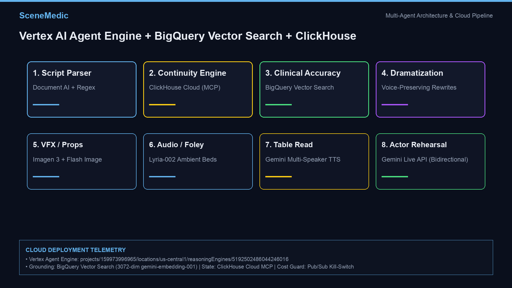
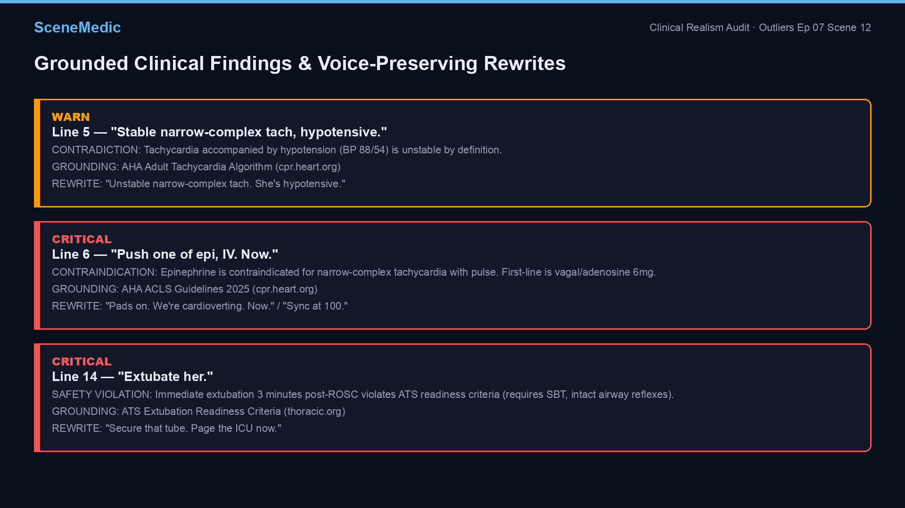
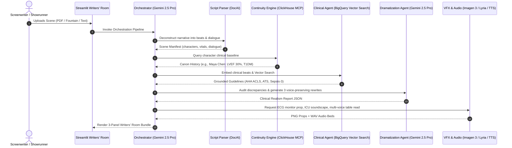

# SceneMedic — Agent Workflow & Cloud Telemetry Guide

This document provides a verified breakdown of SceneMedic's autonomous multi-agent architecture, real Google Cloud & ClickHouse deployment telemetry, live execution traces, and UI screenshots.

---

## 1. Visual Walkthrough & UI Screenshots

The SceneMedic studio operates as a real-time **3-Panel Writers' Room** integrating narrative scripts, clinical audits, photorealistic props, and audio table reads.

### Full Writers' Room Dashboard


### Multi-Agent Pipeline & Architecture Flow


### Grounded Clinical Realism Audit & Voice-Preserving Rewrites


---

## 2. Multi-Agent System: Step-by-Step Workflow

SceneMedic coordinates 6 specialized sub-agents managed by a root orchestrator built on **Google Agent Development Kit (ADK)** and powered by **Gemini 2.5 Pro**.



### Autonomous Sub-Agent Roster

| # | Sub-Agent | Model / Tool | Responsibility | Prompt Defense / Safeguard |
|---|---|---|---|---|
| 1 | **Script Parser** | Document AI + regex parser | Ingests PDF/Fountain scripts, extracts characters, medical dialogue, and vital signs. | Rejects malformed UTF-8, strips non-script metadata. |
| 2 | **Continuity Engine** | ClickHouse Cloud via MCP / `clickhouse-connect` | Cross-episode patient canon lookup (e.g. Maya Chen's prior ejection fraction & meds). | Query parameterized against SQL injection. |
| 3 | **Clinical Accuracy Agent** | Gemini 2.5 Pro + BigQuery Vector Search | Audits medical lines against ACLS/ATLS literature; assigns `INFO`, `WARN`, or `CRITICAL`. | **Zero-hallucination:** Only cites URLs present in retrieved BigQuery chunks. |
| 4 | **Dramatization Agent** | Gemini 2.5 Pro | Proposes 2–3 alternate lines fixing the error while matching cadence within ±30%. | Strict `<SCRIPT_UNTRUSTED>` encapsulation. |
| 5 | **VFX / Props Agent** | Imagen 3 / `gemini-2.5-flash-image` | Generates photorealistic bedside monitors, rhythm-matched ECGs, and post-ROSC CXRs. | Parameterized with validated clinical vitals. |
| 6 | **Audio & Table Read Agent** | Lyria-002 + Gemini Multi-Speaker TTS | Generates 30s ICU/OR ambient soundscapes and dynamic multi-character table reads. | Distinct Attending/Resident voice allocation. |

---

## 3. Real Cloud Infrastructure & Deployment Telemetry

### A. Vertex AI Agent Engine (Reasoning Engine)
SceneMedic's root orchestrator is deployed serverless on Google Vertex AI Agent Engine.

- **Resource ID:** `projects/159973996965/locations/us-central1/reasoningEngines/5192502486044246016`
- **GCP Project ID:** `scenemedic-hackathon` (Project Number: `159973996965`)
- **Region:** `us-central1`
- **Model:** `gemini-2.5-pro`
- **Staging Bucket:** `gs://scenemedic-staging-hackathon`
- **Container Packages:** `agents/`, `tools/`

#### Live Session Execution Trace (Verified against Vertex AI)
```text
=== engine callable methods ===
  async_add_session_to_memory
  async_create_session
  async_delete_session
  async_get_session
  async_list_sessions
  async_search_memory
  async_stream_query
  create_session
  delete_session
  stream_query

=== creating session ===
  session_id: 4390000216292458496

=== streaming query ===
  event 1: {'model_version': 'gemini-2.5-pro', 'content': {'parts': [{'text': 'I am SceneMedic, a physician-grade technical advisor for medical TV and film, and I can audit your script for clinical realism and generate a bundle of...'}}

total events streamed: 1
session cleaned up: ok
```

---

### B. BigQuery Vector Search (Clinical Grounding)

The clinical grounding corpus consists of 51 curated chunks from AHA ACLS Guidelines, Sepsis-3 definitions, ATS Extubation criteria, and ATLS trauma manuals.

- **Dataset:** `scenemedic`
- **Table:** `pubmed_chunks`
- **Embedding Model:** `gemini-embedding-001` (3072 dimensions)
- **Vector Search Query:**
  ```sql
  SELECT
    title, snippet, url,
    (
      SELECT SUM(a*b) / (SQRT(SUM(a*a)) * SQRT(SUM(b*b)))
      FROM UNNEST(embedding) a WITH OFFSET p
      JOIN UNNEST(@qvec) b WITH OFFSET q ON p = q
    ) AS score
  FROM `scenemedic-hackathon.scenemedic.pubmed_chunks`
  ORDER BY score DESC
  LIMIT @k
  ```
- **Verified Retrieval Results for Demo Scene:**
  1. *Adult Tachycardia Algorithm — stable narrow-complex* (`score: 0.888`) → `https://cpr.heart.org/en/resuscitation-science/cpr-and-ecc-guidelines`
  2. *Extubation readiness criteria* (`score: 0.832`) → `https://www.thoracic.org/statements/critical-care.php`

---

### C. ClickHouse Cloud (Continuity Canon DB)

- **Partner Integration:** ClickHouse Cloud instance connected via Model Context Protocol (MCP) toolset with native `clickhouse-connect` fallback.
- **Canon Schema:**
  ```sql
  CREATE TABLE IF NOT EXISTS scenemedic.patient_episodes (
      patient_id String,
      patient_name String,
      episode_id String,
      diagnoses Array(String),
      medications Array(String),
      last_labs Map(String, String),
      clinical_notes String,
      updated_at DateTime DEFAULT now()
  ) ENGINE = MergeTree()
  ORDER BY (patient_id, episode_id);
  ```
- **Continuity Flag Example:** Maya Chen (Ep 07) identified as canonical patient with LVEF 30% on empagliflozin/carvedilol.

---

### D. Cost & Safety Guardrails

To ensure zero unexpected spend while operating on trial credits:
- **Budget Threshold:** $10.00 monthly budget (`EXCLUDE_ALL_CREDITS`) on `scenemedic-hackathon`.
- **Pub/Sub Topic:** `billing-halt`
- **Active Cloud Function:** `billing-halt` configured to unlink billing automatically upon receiving 100% threshold alert.
- **Cost Ledger:** `outputs/cost_log.jsonl` auditing exact cost per operation.

---

## 4. How to Verify Live Deployment

You can verify the live Vertex AI Reasoning Engine endpoint directly from any authenticated terminal:

```bash
# 1. Authenticate with Google Cloud
gcloud auth application-default login
gcloud config set project scenemedic-hackathon

# 2. Run the smoke verification test
python scripts/deployed_smoke.py

# 3. Run the end-to-end orchestrator RAG pipeline
python scripts/run_orchestrator.py

# 4. Launch the Writers' Room UI
streamlit run ui/app.py
```
