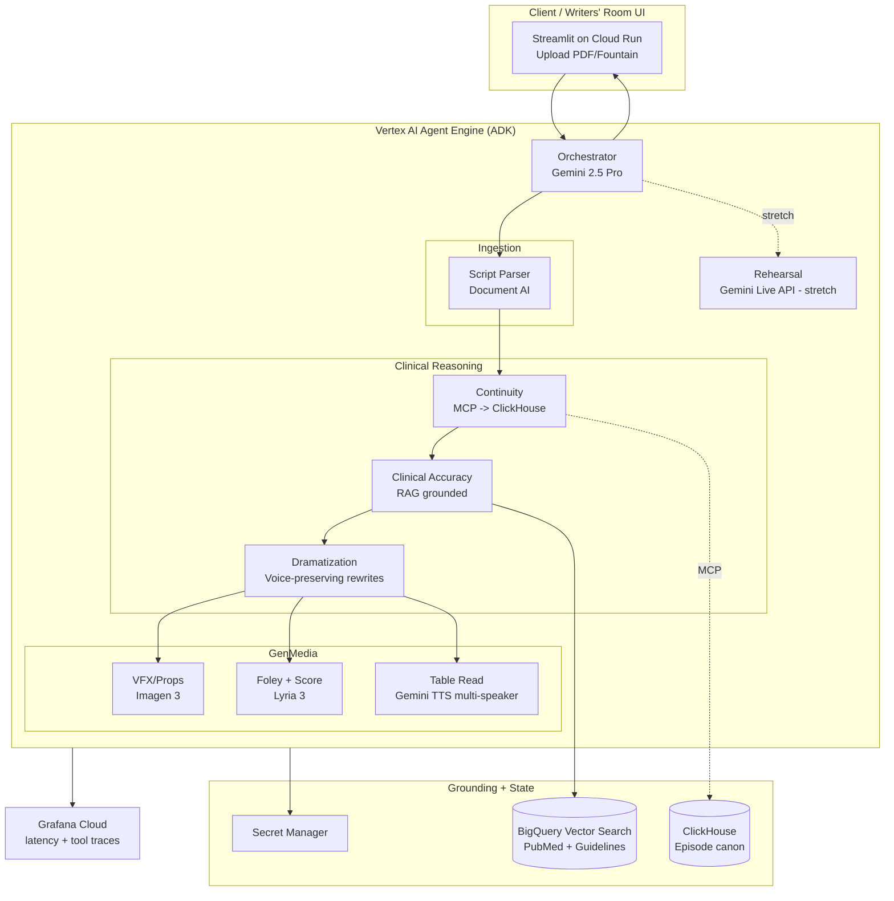

# SceneMedic — Architecture

## Layers

| Layer | Component | Tech |
|---|---|---|
| UI | Uploader + Realism Report viewer | Streamlit on Cloud Run |
| Orchestration | Root agent + 6 sub-agents | Google ADK, Gemini 2.5 Pro |
| Hosting | Serverless agent runtime | Vertex AI Agent Engine |
| Grounding | Semantic search over clinical corpus | BigQuery Vector Search + `text-embedding-004` |
| State | Per-series/per-patient canon | ClickHouse via MCP toolset |
| GenMedia | Props, ambient audio, table read | Imagen 3, Lyria 3, Gemini TTS |
| Observability | Latency + tool-call traces | Grafana Cloud |
| Secrets | Runtime keys | Google Secret Manager |

## Data flow (Hero journey)

1. Writer uploads `Ep07.pdf` → Cloud Run.
2. UI calls Agent Engine endpoint with a GCS URI.
3. Parser Agent → Document AI → scene manifest.
4. Continuity Agent → ClickHouse (via MCP) → prior canon.
5. Clinical Agent → BigQuery RAG → findings JSON.
6. Dramatization Agent → alternate lines JSON.
7. VFX Agent → Imagen 3 → prop GCS URIs.
8. Audio Agent → Lyria 3 beds + Gemini TTS table read.
9. Orchestrator assembles Realism Report bundle.
10. (Stretch) Actor launches Live API rehearsal on-scene.
