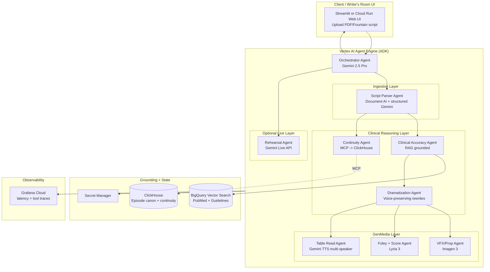

# Agentic Cinema — Strategy Blueprint

Author: Ahmed Zayed, MBBCh (Physician + MSc Applied Health Informatics, RWTH Aachen)
Positioning: physician-engineer bridging clinical realism and cinematic storytelling — the only category where my medical credential is a moat, not a footnote.

---

## Phase 1 — Three Domain-Bridged Concepts

### Concept 1: **SceneMedic** — The Clinical Realism Writers' Room Agent

**Logline:** A multi-agent "medical technical advisor" that reads a TV/film script and returns a scene-by-scene realism audit, corrected dialogue, generated hospital monitor/prop art, ambient ICU soundscapes, and a multi-voice table read — in under 10 minutes.

**Target user:** Writers' rooms and showrunners of medical/procedural dramas (Grey's Anatomy, The Pitt, House M.D. successors, ER reboots) + Netflix/A24 medical thrillers. Secondary: actors prepping roles as physicians, med-tech advertising agencies, medical education film studios.

**Multi-agent architecture (ADK):**
- **Script Parser Agent** — Document AI ingests PDF/Fountain/Final Draft; segments into scenes, characters, medical dialogue lines.
- **Clinical Accuracy Agent** — RAG over PubMed/UpToDate summaries in BigQuery Vector Search; flags dose errors, wrong ECG rhythms, impossible timelines ("V-fib after 30 min asystole"), incorrect PPE/procedure choreography.
- **Dramatization Agent** — rewrites flagged lines to preserve tension while staying clinically defensible; returns 2–3 alternates per fix.
- **VFX/Prop Agent** — Imagen 3 generates monitor readouts (ECG strips, ABG panels), prop labels, X-ray/CT stills matching the scripted pathology.
- **Foley/Score Agent** — Lyria 3 produces ambient OR/ICU beds, code-blue tension cues; Gemini TTS runs multi-speaker table reads with role-appropriate voices (attending, resident, patient, family).
- **Continuity Agent** — ClickHouse stores per-episode canon (Patient A has DM, LVEF 30%) to catch cross-scene contradictions.
- **Orchestrator** — Agent Engine routes and stitches deliverables into a single "Realism Report."

**Tech integration matrix:**

| Component | Tool |
|---|---|
| Reasoning + orchestration | Gemini 2.5 Pro via ADK + Agent Engine |
| Script parsing | Document AI + Gemini structured output |
| Grounding | BigQuery Vector Search (PubMed abstracts, UpToDate-style corpus) |
| Continuity DB | ClickHouse via MCP Database Toolbox |
| Visual props | Imagen 3 (monitors, imaging, prescriptions) |
| Music/foley | Lyria 3 |
| Voice table read | Gemini TTS multi-speaker |
| Live rehearsal | Gemini Live API (actor practices with attending-voice AI) |
| Observability | Grafana on Cloud Run |

**Why it wins:**
- Every hackathon has an "AI scriptwriter." None have a **board-certifiable technical advisor** with a real MD behind the demo. Judges remember the physician who showed a live scene fix that would have cost the production $8k in reshoots.
- Massive real bottleneck: shows pay medical advisors $1500–5000/episode and still ship errors that trend on medical Twitter.
- Demoable in 90 seconds: bad ER scene in → color-coded realism report + regenerated ECG image + fixed dialogue table read out. Visceral.

---

### Concept 2: **Forensica** — Multimodal Crime-Scene & Procedural Realism Engine

**Logline:** A forensic-pathologist-in-a-box for crime dramas — parses scripts, audits time-of-death math, cause-of-death staging, autopsy dialogue, ballistics, tox timelines, and generates matching crime-scene photos, wound diagrams, and coroner audio.

**Target user:** Writers of CSI, Bones, True Detective, Mindhunter-style shows; documentary reenactment producers; true-crime podcast studios.

**Multi-agent architecture (ADK):**
- **Scene Parser** — extracts forensic beats (COD, TOD, weapon, environmental variables).
- **Pathology Agent** — grounded in forensic-medicine references; flags impossible lividity, rigor timelines, wound patterns.
- **Ballistics/Tox Agent** — separate sub-agent for firearms and toxicology (each is its own domain).
- **Legal Chain-of-Custody Agent** — verifies procedural realism (Miranda phrasing, warrant scope, admissibility).
- **Visual Reconstruction Agent** — Imagen 3 for crime-scene layouts, wound diagrams (stylized, not gratuitous), evidence bags.
- **Ambient/Score Agent** — Lyria 3 morgue/interrogation beds; Gemini TTS for detective + coroner reads.
- **Continuity + timeline Agent** — Parallel + ClickHouse verify a 47-hour investigation timeline is internally consistent.

**Tech integration matrix:** same primitives as SceneMedic, plus **Parallel** for parallel timeline branch verification (what suspect was doing at each of 12 timestamps).

**Why it wins:**
- Same physician-authority moat (I read autopsy reports for a living), extended to forensic realism which is one of the most-mocked failure modes on TV.
- Visual output is genuinely dramatic in a demo (before/after crime scene photo, timeline reconciliation).
- **Risk:** wound imagery moderation. Must lean stylized/diagrammatic — set that guardrail up front.

---

### Concept 3: **VitalSigns** — The Actor's Clinical Role Coach (Live-API Rehearsal Studio)

**Logline:** A voice-first rehearsal partner that teaches an actor how a real cardiologist / trauma surgeon / psychiatrist actually speaks, moves, and reasons — through live back-and-forth practice with clinical scenario simulation.

**Target user:** A-list actors prepping medical roles (think prep for The Pitt, Pulse, Grey's guest arcs), acting coaches, casting directors, film-school programs.

**Multi-agent architecture:**
- **Persona Agent** — grounded corpus of real physician speech patterns (interview transcripts, grand rounds recordings), specialty-selectable.
- **Scenario Agent** — spins up dynamic clinical vignettes (STEMI in the ED, psych intake, family meeting for withdrawal of care).
- **Live Interlocutor** — Gemini Live API bidirectional audio; actor rehearses live in-character; agent responds as patient, resident, nurse.
- **Sentiment/Delivery Coach** — multimodal sentiment analysis: is the delivery clinically appropriate (calm-authoritative for STEMI, warm-slow for end-of-life)?
- **Movement/Gesture Notes Agent** — via video upload of actor's rehearsal, Gemini video captioning flags wrong-hand stethoscope, incorrect gowning, wrong intubation sequence.
- **Session Recap** — Lyria 3 for the audition sizzle reel; Imagen 3 for the case dossier (labs, images) the actor "reads" in scene.

**Tech integration matrix:**

| Component | Tool |
|---|---|
| Realtime voice | **Gemini Live API** (headline feature) |
| Sentiment | Multimodal sentiment analysis |
| Video feedback | Gemini video captioning |
| Grounding | BigQuery Vector Search over physician-speech corpus |
| Recap deliverables | Imagen 3 + Lyria 3 |
| Session state | ClickHouse via MCP |

**Why it wins:**
- **Only concept of the three that leads with Live API** — voice-first hackathon demos crush on stage.
- Very concrete "wow" moment: actor talks to the system, gets a live in-character response with clinical realism scoring.
- Narrower scope → cleaner 72-hour build.
- **Risk:** narrower TAM than SceneMedic; demo requires a willing on-camera human.

---

### Recommendation

**Winner: Concept 1 — SceneMedic.** Rationale:
1. **Highest domain-bridge asymmetry.** My MD + informatics MSc is the single sharpest edge in the room; SceneMedic weaponizes it end-to-end.
2. **Exercises the full stack.** Every hackathon prize category (multimodal, MCP, ADK, Live API optional, partner tools) fires on one demo.
3. **Best judge story.** "Physician-engineer built the medical-advisor agent Hollywood pays $5k/episode for" is a one-line pitch that lands.
4. **Extensible.** Forensica and VitalSigns become downstream product lines, not competing bets. I can even swap in a Forensica sub-agent as a stretch feature during the sprint.

---

## Phase 2 — SceneMedic Deep-Dive Blueprint

### 2.1 End-to-end architecture



### 2.2 The Hero User Journey

**Input:** Writer uploads `Ep07_ER_Draft3.pdf` — a 52-page ER episode script.

**Step 1 — Ingest (0–20s).** Parser Agent chunks by scene, extracts characters, locations, medical dialogue lines, procedure beats. Writes a scene manifest to ClickHouse.

**Step 2 — Continuity load (20–25s).** Continuity Agent pulls prior-episode canon: Patient Maya Chen — 34F, T1DM, LVEF 30%, on carvedilol + empagliflozin. Any Ep07 line contradicting this is flagged.

**Step 3 — Realism audit (25s–3m).** Clinical Accuracy Agent walks each medical beat. Example findings:
- Scene 4, line 112: "Push 1 of epi IV" during stable narrow-complex tach → **flag: ACLS deviation, this rhythm calls for adenosine, not epi.**
- Scene 7: chest tube inserted in 4th ICS midaxillary → **correct.**
- Scene 12: patient extubated 3 minutes after ROSC → **flag: implausibly fast.**

**Step 4 — Dramatization rewrite (3–5m).** Dramatization Agent proposes 2–3 rewrites per flag that keep the actor beat and dramatic tension. Delivered as inline redlines with rationale + citation link.

**Step 5 — Visual props (5–7m).** VFX Agent uses Imagen 3 to generate:
- ECG strip showing narrow-complex tach at 180 (matching corrected scene).
- Bedside monitor screenshot with BP 88/54, SpO₂ 91%, matching Maya's labs.
- Chest X-ray showing the pneumothorax the chest tube resolves.
- Med cart prop labels for the correct drug boxes.

**Step 6 — Audio (7–9m).** Lyria 3 renders three ambient beds: ICU quiet, code-blue tension, family-meeting silence. Gemini TTS runs a full multi-speaker table read of the revised Act 2 with distinct voices for Attending, Resident, Maya, and the family member.

**Step 7 — Deliverable (9–10m).** Orchestrator returns a **Realism Report** bundle:
- Annotated PDF (redlined script)
- Realism scorecard (per-scene 0–100, category breakdown)
- Prop image folder
- Audio folder (WAVs)
- Continuity delta log
- Optional: launch **Live Rehearsal** mode — actor talks to the AI attending physician in-character for a live table read.

**Stretch demo moment:** During the pitch, judges paste a fresh 1-scene draft into the UI; SceneMedic returns audit + regenerated ECG + TTS reading in <60 seconds, live.

### 2.3 Code + Tool Schema Skeleton

Directory:

```
scenemedic/
├── pyproject.toml
├── agents/
│   ├── orchestrator.py
│   ├── parser.py
│   ├── clinical.py
│   ├── continuity.py
│   ├── dramatization.py
│   ├── vfx.py
│   ├── audio.py
│   └── live.py
├── tools/
│   ├── document_ai.py
│   ├── rag_pubmed.py
│   ├── clickhouse_mcp.py
│   ├── imagen3.py
│   ├── lyria3.py
│   └── gemini_tts.py
├── deploy/agent_engine.py
└── ui/app.py  # Streamlit
```

**Root agent (ADK):**

```python
# agents/orchestrator.py
from google.adk.agents import Agent
from .parser import parser_agent
from .clinical import clinical_agent
from .continuity import continuity_agent
from .dramatization import dramatization_agent
from .vfx import vfx_agent
from .audio import audio_agent

root_agent = Agent(
    name="scenemedic_orchestrator",
    model="gemini-2.5-pro",
    description="Runs a clinical-realism audit + GenMedia bundle on a submitted script.",
    instruction=(
        "You are SceneMedic, a physician-grade technical advisor for medical "
        "TV/film. Given a script, coordinate sub-agents to (1) parse, "
        "(2) load continuity, (3) audit clinical realism, (4) propose dramatized "
        "rewrites, (5) generate matching props and audio, (6) return a single "
        "Realism Report. Never invent citations. If clinically uncertain, flag "
        "and return the source of doubt."
    ),
    sub_agents=[
        parser_agent,
        continuity_agent,
        clinical_agent,
        dramatization_agent,
        vfx_agent,
        audio_agent,
    ],
)
```

**Clinical accuracy agent with RAG tool:**

```python
# agents/clinical.py
from google.adk.agents import Agent
from ..tools.rag_pubmed import search_pubmed

clinical_agent = Agent(
    name="clinical_accuracy",
    model="gemini-2.5-pro",
    description="Audits medical dialogue and procedure beats for clinical realism.",
    instruction=(
        "For each medical beat: identify the claim, the intervention, and the "
        "expected physiologic response. Compare against grounded sources. "
        "Return a finding with severity (INFO/WARN/CRITICAL), rationale, and "
        "one citation. Only cite what search_pubmed returned."
    ),
    tools=[search_pubmed],
)
```

**RAG tool (BigQuery Vector Search):**

```python
# tools/rag_pubmed.py
from google.cloud import bigquery
from vertexai.language_models import TextEmbeddingModel

_bq = bigquery.Client()
_embed = TextEmbeddingModel.from_pretrained("text-embedding-004")

def search_pubmed(query: str, k: int = 5) -> list[dict]:
    """Semantic search over the SceneMedic clinical corpus.
    Returns list of {title, snippet, url, score}."""
    vec = _embed.get_embeddings([query])[0].values
    sql = """
    SELECT title, snippet, url,
           1 - COSINE_DISTANCE(embedding, @qvec) AS score
    FROM `scenemedic.clinical.pubmed_chunks`
    ORDER BY COSINE_DISTANCE(embedding, @qvec)
    LIMIT @k
    """
    job = _bq.query(
        sql,
        job_config=bigquery.QueryJobConfig(
            query_parameters=[
                bigquery.ArrayQueryParameter("qvec", "FLOAT64", vec),
                bigquery.ScalarQueryParameter("k", "INT64", k),
            ]
        ),
    )
    return [dict(r) for r in job.result()]
```

**Continuity tool over ClickHouse via MCP:**

```python
# tools/clickhouse_mcp.py
from google.adk.tools.mcp_tool import MCPToolset, StdioServerParameters

clickhouse_toolset = MCPToolset(
    connection_params=StdioServerParameters(
        command="uvx",
        args=["mcp-server-clickhouse"],
        env={"CLICKHOUSE_URL": "${CLICKHOUSE_URL}",
             "CLICKHOUSE_USER": "${CLICKHOUSE_USER}",
             "CLICKHOUSE_PASSWORD": "${CLICKHOUSE_PASSWORD}"},
    ),
)
# Attach to continuity_agent.tools = [*clickhouse_toolset.get_tools()]
```

**Imagen 3 prop tool:**

```python
# tools/imagen3.py
from vertexai.preview.vision_models import ImageGenerationModel

_img = ImageGenerationModel.from_pretrained("imagen-3.0-generate-002")

def generate_prop(prompt: str, aspect_ratio: str = "16:9") -> str:
    """Generate a photorealistic on-set prop image. Returns GCS URI."""
    res = _img.generate_images(
        prompt=prompt,
        number_of_images=1,
        aspect_ratio=aspect_ratio,
        safety_filter_level="block_some",
        person_generation="dont_allow",
    )
    return res.images[0]._gcs_uri
```

**Lyria 3 ambient bed tool:**

```python
# tools/lyria3.py
from vertexai.preview.generative_models import GenerativeModel

_lyria = GenerativeModel("lyria-3")

def generate_bed(scene_mood: str, duration_s: int = 30) -> bytes:
    """Return WAV bytes for an ambient bed matching the mood."""
    resp = _lyria.generate_content(
        {"prompt": scene_mood, "duration_seconds": duration_s,
         "genre": "cinematic_ambient"}
    )
    return resp.audio_bytes
```

**Multi-speaker table read tool:**

```python
# tools/gemini_tts.py
from google.genai import Client

_c = Client()

def multi_speaker_read(script: list[dict]) -> bytes:
    """script = [{'speaker': 'Attending', 'voice': 'Kore', 'text': '...'}, ...]"""
    cfg = {
        "response_modalities": ["AUDIO"],
        "speech_config": {
            "multi_speaker_voice_config": {
                "speaker_voice_configs": [
                    {"speaker": s["speaker"],
                     "voice_config": {"prebuilt_voice_config": {"voice_name": s["voice"]}}}
                    for s in script
                ]
            }
        },
    }
    turns = "\n".join(f'{s["speaker"]}: {s["text"]}' for s in script)
    return _c.models.generate_content(
        model="gemini-2.5-flash-preview-tts",
        contents=turns,
        config=cfg,
    ).candidates[0].content.parts[0].inline_data.data
```

**Deployment to Agent Engine:**

```python
# deploy/agent_engine.py
from vertexai import agent_engines
from agents.orchestrator import root_agent

remote = agent_engines.create(
    agent_engine=root_agent,
    requirements=[
        "google-cloud-aiplatform[agent_engines,adk]>=1.101.0",
        "google-cloud-bigquery",
        "clickhouse-connect",
    ],
    display_name="SceneMedic",
)
print(remote.resource_name)
```

### 2.4 48–72h Sprint Roadmap

**H0–H4 — Foundation.**
- Create GCP project, enable Vertex AI + BigQuery + Cloud Run + Secret Manager.
- Redeem $100 hackathon credits + Replit credits.
- Scaffold repo via `agents-cli scaffold create scenemedic --template adk`.
- Bootstrap ClickHouse (managed Cloud) and load a toy episode-canon schema.

**H4–H12 — Corpus + RAG.**
- Load ~2k PubMed abstracts (ACLS, sepsis, trauma, common ER pathologies) into BigQuery with `text-embedding-004`.
- Ship `search_pubmed` tool with unit test.
- Stub Clinical Accuracy Agent, verify one finding on a canned scene.

**H12–H24 — Parser + Continuity.**
- Wire Document AI parser for PDF/Fountain.
- Continuity Agent + ClickHouse MCP toolset.
- Orchestrator wires parser → continuity → clinical, end-to-end on a 3-scene test script.

**H24–H36 — GenMedia layer.**
- Imagen 3 prop generator: prompt templates for ECG, monitor, X-ray, med-cart props.
- Lyria 3 ambient beds (3 presets: ICU-quiet, code-blue, family-meeting).
- Gemini TTS multi-speaker table read; validate with one full Act 2 revision.

**H36–H48 — UI + Deploy.**
- Streamlit uploader on Cloud Run with 3-panel output (annotated script, prop gallery, audio player).
- Push agent to Agent Engine; smoke-test remote endpoint.
- Wire Grafana Cloud dashboard for latency + tool-call traces.
- Secret Manager for all API keys.

**H48–H60 — Hero demo prep.**
- Curate the demo script: one attention-grabbing bad ER scene (wrong drug, wrong rhythm, wrong timeline).
- Rehearse 3-minute pitch:
  0:00–0:20 hook (real cost of medical errors on TV, my MD credibility)
  0:20–1:00 architecture flyover with mermaid
  1:00–2:20 live demo — upload, watch findings appear, show generated ECG + hear TTS
  2:20–2:50 stretch: Live API rehearsal snippet
  2:50–3:00 close (partner integrations, roadmap: Forensica, VitalSigns)
- Record backup screencast — never demo live without a fallback.

**H60–H72 — Polish + submit.**
- Add safety guardrails: Gemini safety settings on tight, refuse patient-identifying prompts, refuse to produce actual medical advice framing.
- README with architecture, install, `agents-cli deploy` command.
- Public repo, 3-min video, submission form.
- Buffer for a broken tool call at H70.

**Stop condition:** Working Agent Engine deployment + 3-minute recorded demo + repo pushed. Do not add features after H60.

---

## Risk register

| Risk | Mitigation |
|---|---|
| Imagen 3 refuses medical imagery | Prompt for stylized/prop imagery, never diagnostic; safety_filter="block_some"; pre-approve 6 prop images to fall back to |
| RAG returns weak hits on rare beats | Pre-index a curated 2k-abstract corpus focused on ER/ICU/OR canon; log low-score queries in Grafana |
| Live API instability during demo | Record fallback rehearsal clip; keep Live as stretch, not mandatory |
| Tool call latency > 90s | Parallelize VFX + Audio + Dramatization via ADK parallel sub-agents; cache demo assets |
| Judge asks "is this HIPAA/PHI" | Answer clearly: no real patient data; corpus is public literature; outputs are fictional scene props |

## Judge-facing one-liner

"SceneMedic is a physician-built multi-agent technical advisor that turns a rough medical drama script into a clinically defensible shooting draft — with matching ECGs, ICU ambience, and a multi-voice table read — in under ten minutes. It's the medical consultant Hollywood pays $5k an episode for, deployed on Vertex Agent Engine."
