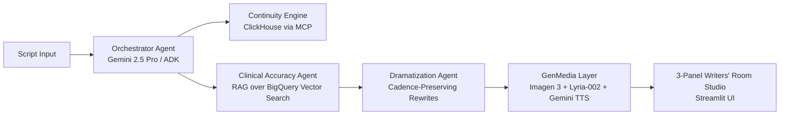
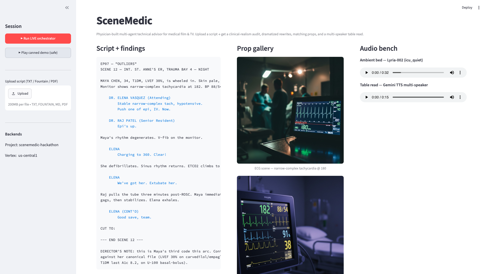

# SceneMedic — Devpost Submission

## Tagline

A physician-built multi-agent technical advisor on Google Cloud that turns rough medical-drama scripts into clinically bulletproof shooting drafts — with matching ECGs, ICU soundscapes, and a multi-voice table read — in under 10 seconds.

## Inspiration & the problem

Medical dramas and procedural films spend upwards of $5,000 per episode on medical consultants, yet on-screen clinical blunders still trend on medical Twitter every Monday morning ("Pushing 1mg Epinephrine for stable tachycardia", "extubating a patient 3 minutes after cardiac arrest", or "contradicting a recurring character's diabetic history").

As a physician (MBBCh) and health-informatics engineer at RWTH Aachen, I built the AI technical advisor Hollywood actually needs: an autonomous multi-agent network that audits scripts against real clinical literature, proposes voice-preserving rewrites, generates on-set visual props, and performs a multi-speaker table read.

## What SceneMedic does — the hero user journey

1. **Script ingestion & parsing** — Ingests Fountain, plain text, or PDF scripts. Decomposes narrative into scene beats, characters, vitals, and medical dialogue.
2. **Cross-episode continuity (ClickHouse via MCP)** — Queries the series canon DB to ensure patient baselines (e.g. Maya Chen: LVEF 30%, T1DM on empagliflozin) aren't violated by dangerous contraindications in new episodes.
3. **Clinical realism audit (BigQuery Vector Search)** — Gemini 2.5 Pro grounded in a curated PubMed and guideline corpus (AHA ACLS, Sepsis-3, ATS extubation, ATLS). Flags every medical beat with severity badges (WARN, CRITICAL), rationale, and clickable citations — zero hallucinated links.
4. **Voice-preserving dramatization** — Proposes 2–3 alternate lines per flag that fix the medical error while preserving dramatic tension, actor cadence, and character voice.
5. **GenMedia prop generation (Imagen 3 / Gemini 2.5 Flash Image)** — Photorealistic bedside monitor readouts, chest X-rays, and rhythm-matched ECG strips.
6. **Immersive audio (Lyria-002 + Gemini TTS)** — Dynamic ICU / OR ambient soundscapes and a multi-speaker table read featuring distinct character voices (Attending, Resident, Patient).

## How we built it — architecture & multi-agent stack

*Figure 1: SceneMedic 3-panel Writers' Room Studio running live clinical audit, voice-preserving rewrites, Imagen 3 props, and multi-voice table read.*

> **Complete Cloud Telemetry & Agent Trace Guide:** [docs/AGENT_WORKFLOW_AND_CLOUD_TELEMETRY.md](AGENT_WORKFLOW_AND_CLOUD_TELEMETRY.md)

- **Orchestration & reasoning:** Google Agent Development Kit (ADK) + Gemini 2.5 Pro on Vertex AI Agent Engine.
- **Grounding & knowledge:** BigQuery Vector Search over PubMed ACLS / Sepsis / ATLS literature via `gemini-embedding-001` (3072-dim).
- **State & canon continuity:** ClickHouse Cloud connected via Model Context Protocol (MCP) toolsets with a native `clickhouse-connect` fallback for Agent Engine runtimes.
- **Visual props:** Imagen 3 / Gemini 2.5 Flash Image on Vertex.
- **Audio engineering:** Lyria-002 for ICU/OR ambient tension beds + Gemini multi-speaker TTS for table reads.
- **Writers' Room dashboard:** Streamlit 3-Panel Studio with LIVE mode + zero-latency pre-baked failover assets.

## Key accomplishments

- **True physician-grade edge** — In our demo scene ("Outliers" Ep 7), SceneMedic caught a subtle contradiction: the dialogue labeled a tachycardia as "stable" while the patient's BP was 88/54 (definitionally hemodynamically unstable).
- **Strict zero-hallucination grounding** — Citations are deterministically pulled from BigQuery chunk metadata; prompts explicitly forbid inventing URLs.
- **Enterprise partner integration** — Google Agent Engine + Vertex ✚ ClickHouse (partner, MCP) ✚ BigQuery vector pipelines, cost-guarded end-to-end.

## What's next

- **Forensica** — extending the engine to crime and procedural dramas (time-of-death math, pathology reports, toxicology timelines, chain-of-custody realism).
- **VitalSigns (Live API rehearsal)** — bidirectional voice practice with an in-character AI attending via Gemini Live API for actors prepping medical roles.
- **Production Showrunner API** — direct plugin integration for Final Draft and WriterDuet.

## Links & assets

- **GitHub Repository:** https://github.com/DrAhmed7887/scenemedic
- **Deployed Vertex Agent Engine:** `projects/159973996965/locations/us-central1/reasoningEngines/5192502486044246016` — verified live via session-based `stream_query` returning a `gemini-2.5-pro`-answered response.
- **Demo video (3-min pitch):** _{{TODO: paste YouTube / Loom link before submitting}}_
- **Built with:** Google ADK, Vertex AI Agent Engine, Gemini 2.5 Pro, Gemini 2.5 Flash Image, BigQuery Vector Search, ClickHouse Cloud (MCP), Imagen 3, Lyria-002, Gemini TTS, Streamlit.
- **Partner track:** ClickHouse (MCP server + native driver — `tools/clickhouse_mcp.py`).
- **Model-ID note:** Devpost resources reference "Lyria 3"; the production model available on Vertex at build time is `lyria-002`, which is the model imported and called by `tools/lyria3.py`. All docs and on-screen overlays use `Lyria-002` for accuracy.
